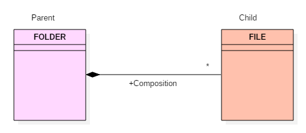
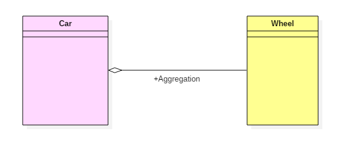

# UML Association vs Aggregation vs Composition with EXAMPLE

  - Details  
     Last Updated:
    06 February 2020

Relationships in UML diagram are used to represent a connection between
various things. A relationship is a connection amongst things such as
structural, behavioral, or grouping things in the unified modeling
language.

Following are the different types of standard relationships in UML,

  - Association
  - Dependency
  - Generalization
  - Realization

Other than these, UML allows the use of aggregation and a composition
relationship.

In this UML tutorial, you will learn:

  - [Association](#1)
  - [Composition](#2)
  - [Aggregation](#3)
  - [Difference](#4)

## Association

It is a structural relationship that represents objects can be connected
or associated with another object inside the system. Following
constraints can be applied to the association relationship.

  - **{implicit}** – Implicit constraints specify that the relationship
    is not manifest; it is based upon a concept.
  - **{ordered}** – Ordered constraints specify that the set of objects
    at one end of an association are in a specific way.
  - **{changeable}** – Changeable constraint specifies that the
    connection between various objects in the system can be added,
    removed, and modified as per the requirement.
  - **{addOnly}** – It specifies that the new connections can be added
    from an object which is situated at the other end an association.
  - **{frozen}** – It specifies that when a link is inserted between two
    objects, then it cannot be modified while the frozen constraint is
    active on the given link or a connection.

We can also create a class that has association properties; it is called
as an association class.

### Reflexive association

The reflexive association is a subtype of association relationship in
UML. In a reflexive association, the instances of the same class can be
related to each other. An instance of a class is also said to be an
object.

Reflexive association states that a link or a connection can be present
within the objects of the same class.

**Example**:

Let us consider an example of a class fruit.

The fruit class has two instances, such as mango and apple. Reflexive
association states that a link between mango and apple can be present as
they are instances of the same class, such as fruit.

### Directed association

As the name suggests, the directed association is related to the
direction of flow within association classes.

In a directed association, the flow is directed. The association from
one class to another class flows in a single direction only.

It is denoted using a solid line with an arrowhead.

**Example**:

You can say that there is a directed association relationship between a
server and a client.

A server can process the requests of a client. This flow is
unidirectional, that flows from server to client only. Hence a directed
association relationship can be present within servers and clients of a
system.

## Composition

It is not a standard UML relationship, but it is still used in various
applications.

Composite aggregation is a subtype of aggregation relation with
characteristics as:

  - It is a two-way association between the objects.
  - It is a whole/part relationship.
  - If a composite is deleted, all other parts associated with it are
    deleted.

Composite aggregation is described as a binary association decorated
with a filled black diamond at the aggregate (whole) end.

The folder could contain many files, while each File has exactly one
Folder parent. If a folder is deleted, all contained files are removed
as well.

In a composite aggregation, an object may be a part of only one
composite at a time.

**Example**:

For example, in a windowing system, a Frame belongs to precisely one
Window. In a composite aggregation, the whole system is responsible for
the disposition of its parts, which means that the composite must manage
the creation and destruction of its parts.

## Aggregation

An aggregation is a subtype of an association relationship in UML.
Aggregation and composition are both the types of association
relationship in UML. An aggregation relationship can be described in
simple words as "an object of one class can own or access the objects of
another class."

In an aggregation relationship, the dependent object remains in the
scope of a relationship even when the source object is destroyed.

**Example**:

Let us consider an example of a car and a wheel.

A car needs a wheel to function correctly, but a wheel doesn't always
need a car. It can also be used with the bike, bicycle, or any other
vehicles but not a particular car. Here, the wheel object is meaningful
even without the car object. Such type of relationship is called an
aggregation relation.

## Association vs. Aggregation vs. Composition

|                                                                                                                             |                                                                                                                                       |                                                                                                                                          |
| --------------------------------------------------------------------------------------------------------------------------- | ------------------------------------------------------------------------------------------------------------------------------------- | ---------------------------------------------------------------------------------------------------------------------------------------- |
| **Association**                                                                                                             | **Aggregation**                                                                                                                       | **Composition**                                                                                                                          |
| Association relationship is denoted using an arrow.                                                                         | Aggregation relationship is denoted using a straight line with an empty arrowhead at one end.                                         | Composition relationship is denoted using a straight line with a filled arrowhead at any one of the ends.                                |
| Association can exist between two or more classes in UML.                                                                   | Aggregation is a part of an association relationship.                                                                                 | The composition is a part of an association relationship.                                                                                |
| There can be one-one, one-many, many-one, and many-many association present between the association classes.                | Aggregation is considered as a weak type of association.                                                                              | The composition is considered as a strong type of association.                                                                           |
| In an association relationship, one or more objects can be associated with each other.                                      | In an aggregation relationship, objects that are associated with each other can remain in the scope of a system without each other.   | In a composition relationship, objects that are associated with each other cannot remain in the scope without each other.                |
| Objects are linked with each other.                                                                                         | Linked objects are not dependent upon the other object.                                                                               | Objects are highly dependent upon each other.                                                                                            |
| In association, deleting one element may or may not affect another associated element.                                      | In aggregation, deleting one element does not affect another associated element.                                                      | In composition, deleting one element affects another associated element.                                                                 |
| Example: **** A teacher is associated with multiple students. **** Or **** a teacher provides instructions to the students. | Example: A car needs a wheel, but it doesn't always require the same wheel. A car can function adequately with another wheel as well. | Example: A file is placed inside the folder. If one deletes the folder, then the file associated with that given folder is also deleted. |

## Summary

  - A relationship is a connection between things.
  - Association, dependency, generalization, and realization are various
    relationships provided by UML.
  - Apart from standard relationships, composition and aggregation are
    used inside the UML.
  - Aggregation and composition are both the types of association
    relationship in UML.
  - The composition is a two-way relationship which is also called as a
    binary relationship.

 

  - [
    Prev](/uml-relationships-with-example.html "UML Relationships with EXAMPLE:  Dependency, Generalization, Realization")
  - [Next
    ](/uml-class-diagram.html "UML Class Diagram Tutorial with Examples")

