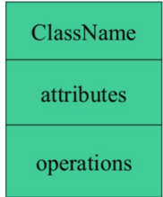
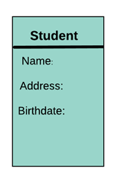
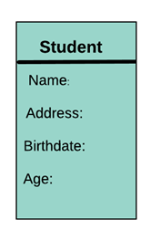
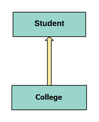
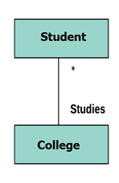
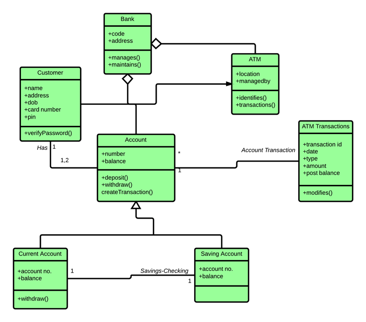

# UML Class Diagram Tutorial with Examples

  - Details  
     Last Updated:
    06 February 2020

## What is Class?

A Class is a blueprint that is used to create Object. The Class defines
what object can do.

## What is Class Diagram?

Class Diagram gives the static view of an application. A class diagram
describes the types of objects in the system and the different types of
relationships that exist among them. This modeling method can run with
almost all Object-Oriented Methods. A class can refer to another class.
A class can have its objects or may inherit from other classes.

UML Class Diagram gives an overview of a software system by displaying
classes, attributes, operations, and their relationships. This Diagram
includes the class name, attributes, and operation in separate
designated compartments.

Class Diagram helps construct the code for the software application
development.

In this tutorial, you will learn:

[What is Class?](#1)

[What is Class Diagram?](#2)

[Benefits of Class Diagram](#3)

[Essential elements of A UML class diagram](#4)

  - [Class Name](#5)
  - [Attributes:](#6)
  - [Relationships](#7)

[Aggregation vs. Composition](#8)

[Abstract Classes](#9)

[Example of UML Class Diagram:](#10)

[Class Diagram in Software Development Lifecycle:](#11)

[Best practices of Designing of the Class Diagram](#12)

## Benefits of Class Diagram

  - Class Diagram Illustrates data models for even very complex
    information systems
  - It provides an overview of how the application is structured before
    studying the actual code. This can easily reduce the maintenance
    time
  - It helps for better understanding of general schematics of an
    application.
  - Allows drawing detailed charts which highlights code required to be
    programmed
  - Helpful for developers and other stakeholders.

## Essential elements of A UML class diagram

Essential elements of UML class diagram are:

1.  Class Name
2.  Attributes
3.  Operations

### Class Name

The name of the class is only needed in the graphical representation of
the class. It appears in the topmost compartment. A class is the
blueprint of an object which can share the same relationships,
attributes, operations, & semantics. The class is rendered as a
rectangle, including its name, attributes, and operations in sperate
compartments.

Following rules must be taken care of while representing a class:

1.  A class name should always start with a capital letter.
2.  A class name should always be in the center of the first
    compartment.
3.  A class name should always be written in **bold** format.
4.  An abstract class name should be written in italics format.

### Attributes:

An attribute is named property of a class which describes the object
being modeled. In the class diagram, this component is placed just below
the name-compartment.

A derived attribute is computed from other attributes. For example, an
age of the student can be easily computed from his/her birth date.

Attributes characteristics

  - The attributes are generally written along with the visibility
    factor.
  - Public, private, protected and package are the four visibilities
    which are denoted by +, -, \#, or \~ signs respectively.
  - Visibility describes the accessibility of an attribute of a class.
  - Attributes must have a meaningful name that describes the use of it
    in a class.

### Relationships

There are mainly three kinds of relationships in UML:

1.  Dependencies
2.  Generalizations
3.  Associations

**Dependency**

A dependency means the relation between two or more classes in which a
change in one may force changes in the other. However, it will always
create a weaker relationship. Dependency indicates that one class
depends on another.

In the following example, Student has a dependency on College

**Generalization:**

A generalization helps to connect a subclass to its superclass. A
sub-class is inherited from its superclass. Generalization relationship
can't be used to model interface implementation. Class diagram allows
inheriting from multiple superclasses.

In this example, the class Student is generalized from Person Class.

**Association:**

This kind of relationship represents static relationships between
classes A and B. For example; an employee works for an organization.

Here are some rules for Association:

  - Association is mostly verb or a verb phrase or noun or noun phrase.
  - It should be named to indicate the role played by the class attached
    at the end of the association path.
  - Mandatory for reflexive associations

In this example, the relationship between student and college is shown
which is studies.

**Multiplicity**

A multiplicity is a factor associated with an attribute. It specifies
how many instances of attributes are created when a class is
initialized. If a multiplicity is not specified, by default one is
considered as a default multiplicity.

Let's say that that there are 100 students in one college. The college
can have multiple students.

**Aggregation**

Aggregation is a special type of association that models a whole- part
relationship between aggregate and its parts.

For example, the class college is made up of one or more student. In
aggregation, the contained classes are never totally dependent on the
lifecycle of the container. Here, the college class will remain even if
the student is not available.

**Composition:**

The composition is a special type of aggregation which denotes strong
ownership between two classes when one class is a part of another class.

For example, if college is composed of classes student. The college
could contain many students, while each student belongs to only one
college. So, if college is not functioning all the students also
removed.

## Aggregation vs. Composition

|                                                                                                                                                                                                               |                                                                                                                                                                                |
| ------------------------------------------------------------------------------------------------------------------------------------------------------------------------------------------------------------- | ------------------------------------------------------------------------------------------------------------------------------------------------------------------------------ |
| **Aggregation**                                                                                                                                                                                               | **Composition**                                                                                                                                                                |
| Aggregation indicates a relationship where the child can exist separately from their parent class. Example: Automobile (Parent) and Car (Child). So, If you delete the Automobile, the child Car still exist. | Composition display relationship where the child will never exist independent of the parent. Example: House (parent) and Room (child). Rooms will never separate into a House. |

## Abstract Classes

It is a class with an operation prototype, but not the implementation.
It is also possible to have an abstract class with no operations
declared inside of it. An abstract is useful for identifying the
functionalities across the classes. Let us consider an example of an
abstract class. Suppose we have an abstract class called as a motion
with a method or an operation declared inside of it. The method declared
inside the abstract class is called a **move ()**.

This abstract class method can be used by any object such as a car, an
animal, robot, etc. for changing the current position. It is efficient
to use this abstract class method with an object because no
implementation is provided for the given function. We can use it in any
way for multiple objects.

In UML, the abstract class has the same notation as that of the class.
The only difference between a class and an abstract class is that the
class name is strictly written in an italic font.

An abstract class cannot be initialized or instantiated.

In the above abstract class notation, there is the only a single
abstract method which can be used by multiple objects of classes.

## Example of UML Class Diagram

Creating a class diagram is a straightforward process. It does not
involve many technicalities. Here, is an example:

ATMs system is very simple as customers need to press some buttons to
receive cash. However, there are multiple security layers that any ATM
system needs to pass. This helps to prevent fraud and provide cash or
need details to banking customers.

Below given is a UML Class Diagram example:

## Class Diagram in Software Development Lifecycle

Class diagrams can be used in various software development phases. It
helps in modeling class diagrams in three different perspectives.

**1. Conceptual perspective:** Conceptual diagrams are describing things
in the real world. You should draw a diagram that represents the
concepts in the domain under study. These concepts related to class and
it is always language-independent.

**2. Specification perspective:** Specification perspective describes
software abstractions or components with specifications and interfaces.
However, it does not give any commitment to specific implementation.

**3. Implementation perspective:** This type of class diagrams is used
for implementations in a specific language or application.
Implementation perspective, use for software implementation.

## Best practices of Designing of the Class Diagram

Class diagrams are the most important UML diagrams used for software
application development. There are many properties which should be
considered while drawing a Class Diagram. They represent various aspects
of a software application.

Here, are some points which should be kept in mind while drawing a class
diagram:

  - The name given to the class diagram must be meaningful. Moreover, It
    should describe the real aspect of the system.
  - The relationship between each element needs to be identified in
    advance.
  - The responsibility for every class needs to be identified.
  - For every class, minimum number of properties should be specified.
    Therefore, unwanted properties can easily make the diagram
    complicated.
  - User notes should be included whenever you need to define some
    aspect of the diagram. At the end of the drawing, it must be
    understandable for the software development team.
  - Lastly, before creating the final version, the diagram needs to be
    drawn on plain paper. Moreover, It should be reworked until it is
    ready for final submission.

## Conclusion

  - UML is the standard language for specifying, designing, and
    visualizing the artifacts of software systems
  - A class is a blueprint for an object
  - A class diagram describes the types of objects in the system and the
    different kinds of relationships which exist among them
  - It allows analysis and design of the static view of a software
    application
  - Class diagrams are most important UML diagrams used for software
    application development
  - Essential elements of UML class diagram are 1) Class 2) Attributes
    3) Relationships
  - Class Diagram provides an overview of how the application is
    structured before studying the actual code. It certainly reduces the
    maintenance time
  - The class diagram is useful to map object-oriented programming
    languages like Java, C++, Ruby, Python, etc.

 

  - [
    Prev](/association-aggregation-composition-difference.html "UML Association vs Aggregation vs Composition with EXAMPLE")
  - [Next
    ](/uml-object-diagram.html "What is UML Object Diagram? Tutorial with Example")

